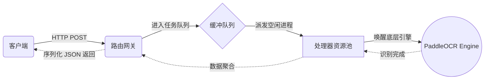

# ocr-server-go

**ocr-server-go** 是一款专为 Linux 环境打造的高并发光学字符识别（OCR）微服务程序。本项目采用 Go 语言精心打磨，底层深度对接强大的 PaddleOCR 引擎，致力于为企业级应用提供极速、精准的文本解析能力。凭借卓越的架构设计，它非常适合对吞吐量和稳定性要求严苛的生产场景。

## 快速导航
1. [项目简介](#项目简介)
2. [核心优势](#核心优势)
3. [部署指南](#部署指南)
4. [运行与操作](#运行与操作)
5. [配置详解](#配置详解)
6. [技术架构](#技术架构)
7. [性能表现](#性能表现)

---

## 核心优势

- **高吞吐调度**：内置独立调优的处理器池（Processor Pool），专治高并发请求拥堵。
- **弹性扩缩容**：系统会根据任务队列的压力，全自动管理 OCR 实例的创建与回收。
- **极致高可用**：搭载守护程序级别的健康检查，对失效实例自动执行无感替换，服务坚如磐石。
- **数据流友好**：支持传统服务器绝对路径读取，同时也支持客户端直接上报 Base64 图片流。
- **灵活参数化**：深度集成 Viper，支持通过 `yaml` 或命令行参数自由定义启动逻辑。
- **完善的监控**：提供开箱即用的 `/stats` 性能指标探针以及支持自动切分压缩的日志记录功能。
- **一键自动化**：内置环境初始化逻辑，若检测无引擎会自动下载必要的 OCR 核心组件。

---

## 部署指南

### 环境准备与编译

1. **获取代码**：
```bash
git clone https://github.com/wang-zhibo/ocr-server-go-go.git
```
2. **进入工作区**：
```bash
cd ocr-server-go
```
3. **拉取依赖包**：
```bash
go mod tidy
```
4. **编译为可执行文件**：
```bash
go build -o ocr-server-go cmd/server/main.go
```

---

## 运行与操作

### 基础启动方法

如果你只需要快速体验或测试，可以直接无参数运行（系统将采用内置的最佳实践配置）：

```bash
./ocr-server-go
```
> *注：若是全新环境首次运行，程序将自动在后台下载 PaddleOCR 的运行模型和组件。*

### Linux 进阶启动（命令行传参）

为了满足复杂的线上环境，你可以通过启动参数来覆盖默认逻辑：

**指定配置文件启动**：
只需确保 `.ocr-server-go/config.yaml` 存在，直接启动即可加载。

**通过参数覆盖基础网络设置**：
```bash
./ocr-server-go -addr 0.0.0.0 -port 8080 -min-processors 8 -log-file server.log
```

**全参数启动演示（适用于骨灰级调优）**：
```bash
./ocr-server-go -addr 192.168.1.100 -port 8080 -ocr /opt/ocr/PaddleOCR-json -min-processors 8 -max-processors 16 -queue-size 200 -scale-threshold 100 -degrade-threshold 50 -idle-timeout 10m -warm-up-count 4 -shutdown-timeout 1m -log-file /var/log/ocr_server.log -log-max-size 200 -log-max-backups 5 -log-max-age 30 -log-compress
```

**查阅帮助文档**：
```bash
./ocr-server-go -help
```

### 将其作为 Systemd 后台服务守护

在 Linux 生产环境中，强烈建议使用 Systemd 进行进程托管：

**1. 编写 Unit 文件**：
```bash
sudo nano /etc/systemd/system/ocr-server-go.service
```
复制下方模板（请务必将 `/opt/ocr-server-go` 替换为你的真实安装路径）：
```ini
[Unit]
Description=OCR Server Go Daemon
After=network.target

[Service]
Type=simple
User=root
ExecStart=/opt/ocr-server-go/ocr-server-go
Restart=on-failure
WorkingDirectory=/opt/ocr-server-go

[Install]
WantedBy=multi-user.target
```

**2. 加载并激活服务**：
```bash
sudo systemctl daemon-reload
sudo systemctl start ocr-server-go
sudo systemctl enable ocr-server-go
```

**3. 日志巡检与监控**：
```bash
sudo systemctl status ocr-server-go
journalctl -u ocr-server-go -f
```

---

## API 调用参考

本服务对外暴露了非常简洁的 RESTful JSON 接口。

### 1. 发起 OCR 识别请求
使用 Base64 编码方式（推荐用于网络传输）：
```http
POST /
Content-Type: application/json

{
  "image_base64": "此处填入图片的 base64 字符串"
}
```

使用本地路径方式（适用于服务和图片在同一台机器）：
```http
POST /
Content-Type: application/json

{
  "image_path": "/data/images/test.jpg"
}
```

### 2. 探针与监控
获取当前服务器的并发状态、健康度、处理耗时等统计信息：
```http
GET /stats
```

---

## 配置详解

服务运行时支持的各项核心配置如下：

| 参数名称 | 作用说明 | 默认参数 |
|------|------|--------|
| `addr` | 服务监听的 IP 地址 | `localhost` |
| `port` | 暴露的网络端口 | `1111` |
| `ocr_exe_path` | 引擎可执行文件的绝对路径 | 自动扫描或下载 |
| `min_processors` | 常驻内存的最小进程数 | `4` |
| `max_processors` | 允许弹出的最大进程数 | `CPU 物理核心数` |
| `queue_size` | 等待处理的任务缓冲池大小 | `100` |
| `scale_threshold` | 触发自动扩容的阈值（%） | `75` |
| `degrade_threshold` | 触发自动缩容的闲置阈值（%） | `25` |
| `idle_timeout` | 空闲进程的存活时间 | `5分钟` |
| `warm_up_count` | 预留的备用热启动进程数 | `2` |
| `shutdown_timeout` | 平滑退出的等待超时时间 | `30秒` |
| `log_file_path` | 运行日志输出路径 | `ocr_server.log` |
| `log_max_size` | 单个日志包最大体积(MB) | `100` |
| `log_max_backups` | 历史日志保留份数 | `3` |
| `log_max_age` | 历史日志最长保留期限(天) | `28` |
| `log_compress` | 是否开启归档日志 Gzip 压缩 | `true` |
| `threshold-mode` | 图像预处理：二值化算法模式 | `0` |
| `threshold-value`| 图像预处理：固定阈值参数 | `100` |

### 关于图像二值化（预处理）的特别说明：
- **模式 `0` ("binary")**：强制采用 `threshold-value` 指定的固定值（0-255）对图片进行切分二值化。
- **模式 `1` ("otsu")**：启用大津算法（Otsu's Method），系统将针对每张图片自动求算最佳的全局阈值（此时会忽略 `threshold-value` 配置）。这在文档扫描或背景对比度鲜明的场景下表现极佳。

---

## 技术架构

ocr-server-go 在内部划分了清晰的职责边界，以实现代码的健壮性：

1. **流量网关 (Server)**：接管 HTTP 连接、解析请求、管理数据流的进出。
2. **实例管理池 (Processor Pool)**：作为系统的“心脏”，调度与维持多组并发的 OCR 处理单元。
3. **缓冲队列 (Task Queue)**：应对突发流量的“蓄水池”，避免因并发过高导致系统崩溃。
4. **图像解析层 (OCR Engine)**：深度绑定 PaddleOCR，完成图片到文字的提取算力消耗。
5. **基础设施矩阵**：涵盖了动态配置读取 (`Config`)、结构化日志记录 (`Logger`)、运行时指标收集 (`Stats`)。

**处理链路简图**：


---

## 性能表现

本项目对高负载场景做了大量针对性强化：
- 基于协程的高效非阻塞队列，实现极低的排队延迟。
- 根据真实吞吐量自动加减底层进程，达成性能与资源的完美平衡。
- `Warm-up` 预热策略有效规避了冷启动引发的性能抖动。
- Base64 流传输直进直出，尽可能绕过了磁盘 I/O 带来的短板效应。

---

## 常见问题

**Q: 启动后无法识别，报错 OCR Engine NotFound？**
A: 请确保运行服务器具备外网访问权限以便自动下载依赖，或者你也可以手动下载 PaddleOCR-json 并将绝对路径写入 `ocr_exe_path` 配置中。

**Q: 在高并发下服务器内存飙升？**
A: 请检查是否配置了过大的 `max_processors`，每个引擎子进程都会占用独立的系统内存资源，请结合你的物理服务器内存进行合理缩减。


## 开源协议

本项目遵守 MIT 开源协议 - 详见 [LICENSE](LICENSE) 文档。